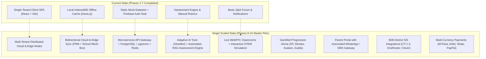
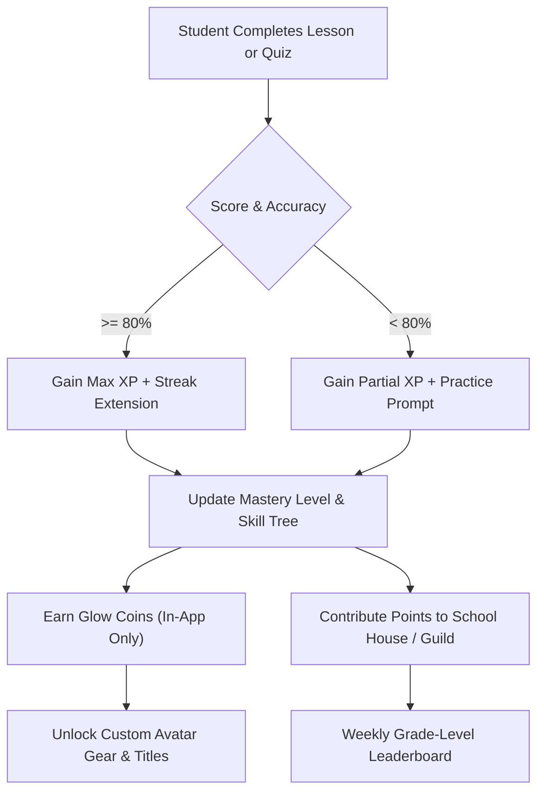
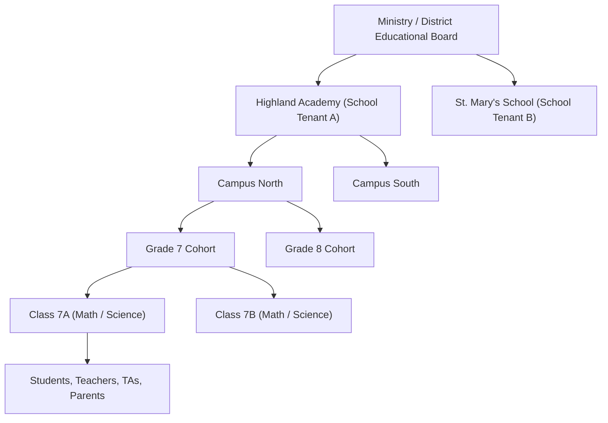
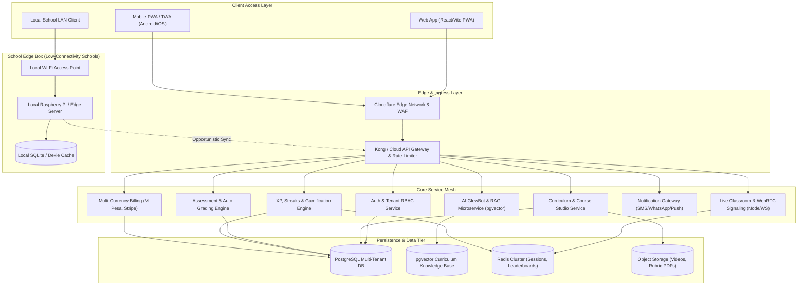

# Grade Glow Hub: Master Scaling Plan & Enterprise Architecture Roadmap

> **Document Version:** 2.0.0  
> **Target Scale:** 1,000,000+ Concurrent Students Across Global & Emerging Market Schools  
> **Target Audience:** Grades 4–9 (Ages 9–15), Educators, School Administrators, District Leads, and Parents  
> **Status:** APPROVED STRATEGIC BLUEPRINT — *Planning Mode (No Implementation Initiated)*

---

## Executive Summary

**Grade Glow Hub** has successfully transitioned from an initial UI concept into a robust, domain-driven learning platform with **259 passing automated Vitest tests**, 9 Playwright end-to-end suites, indexed offline persistence (Dexie.js), internationalization (EN/SW), instructor studios, gradebook calculation engines, and administrative governance (Phases 1–7 documented in [`addition.md`](file:///home/lizah/Desktop/grade-glow-hub/addition.md)).

To scale Grade Glow Hub into a premier global EdTech ecosystem capable of serving **individual learners, private academies, public school districts, and low-connectivity emerging markets**, the platform must expand beyond a client-side single-tenant LMS into a **cloud-native, multi-tenant, AI-accelerated, and edge-resilient educational operating system**.

This document outlines the **Master Scaling Strategy**, detailing:
1. **8 New Architectural Horizons & Expansion Modules** to add to the platform.
2. **Enterprise Cloud & Edge Hybrid Infrastructure**.
3. **Multi-Tenancy & School District Hierarchy**.
4. **Child Safety, COPPA/GDPR-K Compliance & Examination Proctoring**.
5. **Phase-by-Phase Execution Roadmap (Phases 8–15)** with milestones and LoC allocations.

---

## 1. Architectural Baseline (Current vs. Scaled State)

---

## 2. The 8 New Expansion Horizons to Add

### Horizon 1: AI-Powered Learning & Hyper-Personalization ("GlowBot Suite")
Current assessments and lessons follow static tracks. Scaling requires dynamic AI that personalizes instruction to each child's pace without teachers needing to author 50 variants of every lesson.

* **Socratic AI Tutor ("GlowBot")**:
  - Interactive companion modal embedded within lessons and homework assignments.
  - Socratic guiding mode: Never gives the raw answer directly; provides conceptual hints, scaffolding, and step-by-step breakdown.
  - Safe Guardrails: Built-in safety boundary filters refusing non-academic queries or inappropriate content.
* **Automated Curriculum & Exam Generation (RAG Pipeline)**:
  - Ingests official curriculum PDFs (e.g., KICD CBC, Cambridge Primary/Lower Secondary, US Common Core).
  - One-click quiz and worksheet generation for teachers with configurable Bloom's Taxonomy distribution (Knowledge, Application, Analysis).
* **AI Essay & Open-Response Automated Evaluation**:
  - Semantic rubric-based scoring providing immediate constructive grammar, vocabulary, structure, and thesis feedback.
  - Highlights weak sentences and recommends targeted mini-lessons.
* **Bayesian Knowledge Tracing (BKT) & Adaptive Learning Paths**:
  - Real-time mastery estimation per micro-skill (e.g., *Fractions: Uncommon Denominators*).
  - Automatically adjusts quiz question difficulty based on dynamic student mastery level (Easy $\rightarrow$ Medium $\rightarrow$ Challenge).
* **Early Warning Dropout & At-Risk Predictor**:
  - Machine learning telemetry identifying learning regression or disengagement 2 weeks before exams, alerting instructors and counselors.

---

### Horizon 2: Real-Time Live Classrooms & Interactive STEM Virtual Labs
Moving beyond text and pre-recorded videos to synchronous and tactile learning experiences.

* **WebRTC Real-Time Virtual Classroom**:
  - Ultra-low latency voice/video optimized for low-bandwidth environments (auto-downsampling from 1080p to 240p based on packet loss).
  - Collaborative synchronized digital whiteboard (vector drawing, shape recognition, latex math formula rendering).
  - Virtual Breakout Rooms and hand-raising queue with teacher moderation controls.
* **Interactive STEM Virtual Labs & Physics Simulators**:
  - Integration with **PhET Interactive Simulations** (Circuit construction, solar system orbits, acid-base titration).
  - **GeoGebra Math Plotter** integration for dynamic geometry and algebraic transformations.
  - **Blockly / Scratch Visual Coding Sandbox** allowing students to learn computational thinking directly in browser.
* **H5P Interactive Video Engine**:
  - Checkpoint questions embedded directly into lecture videos (video pauses automatically until answered correctly).
  - Branching video scenarios where student decisions dictate the learning outcome.
* **Micro-Podcasts & Audio-First Lessons**:
  - 5-to-8 minute bite-sized audio lessons with synchronized transcripts for offline commute and auditory learners.

---

### Horizon 3: Gamification, Motivation & Student Retention Arena
Students in grades 4–9 (ages 9–15) require intrinsic and extrinsic feedback loops to sustain daily study habits.

* **Mastery Skill Trees & Leveling System**:
  - Visual constellation/node tree for each subject (unlocking nodes as prerequisites are satisfied).
  - Daily learning streaks with "Streak Freeze" mechanisms.
* **Multiplayer Quiz Arena ("GlowArena")**:
  - Synchronous live multiplayer quizzes (Kahoot / Quizizz style) hosted by teachers in class.
  - Asynchronous 1-on-1 friendly challenges between classmates on subject modules.
* **Avatar Customization & Cosmetic Reward Vault ("GlowStore")**:
  - 100% free of real-money microtransactions (Strict Child Safety Policy).
  - Cosmetic accessories, pets, badges, and interface themes unlocked exclusively through academic diligence and mastery milestones.
* **School House & Guild Collaboration**:
  - Students grouped into school houses or study guilds, fostering cooperative teamwork rather than purely individual competition.

---

### Horizon 4: Parent & Guardian Portal ("GradeGlow Family")
Parents are the primary buyers and decision-makers for K-12 learning platforms. Enabling parents increases student accountability and boosts subscription retention.

* **Dedicated Parent Companion Dashboard**:
  - Separate login role (`parent`) linked to multiple student accounts.
  - At-a-glance visualization of daily attendance, homework completion rate, and upcoming exam schedules.
  - Screen-time and platform engagement monitoring.
* **Automated WhatsApp & SMS Progress Dispatches**:
  - Bi-weekly automated SMS or WhatsApp summary in local language (e.g., English / Swahili):
    *"Hello Mrs. Kamau, Kevin completed 4 math modules this week with an 88% average score. Next Science Quiz is this Thursday."*
  - Critical alerts for missed assignment deadlines or notable performance drops.
* **Parent-Teacher Direct Messaging (Safe & Monitored)**:
  - Controlled messaging channel between parents and instructors with automated appointment scheduling for parent-teacher conferences.

---

### Horizon 5: Enterprise Multi-Tenancy & School District B2B Scale
Enables enterprise sales to entire school networks, government educational boards, and private academy chains.

* **Hierarchical Tenant Scoping**:
  - Logical and database tenant partitioning: `Organization` $\rightarrow$ `School` $\rightarrow$ `Campus` $\rightarrow$ `Academic Year` $\rightarrow$ `Grade` $\rightarrow$ `Section/Class`.
  - Strict tenant data isolation preventing cross-tenant leakage.
* **White-Labeling & Custom Subdomains**:
  - Schools operate on dedicated vanity domains (e.g., `highland.gradeglow.com` or custom CNAME `lms.highlandacademy.edu`).
  - Customizable logo, brand colors, badge shields, and welcome messages.
* **OneRoster & LTI 1.3 Interoperability**:
  - Integration with **LTI 1.3 / Advantage** for seamless embedding into existing LMS infrastructures (Canvas, Blackboard, Moodle).
  - Bi-directional sync via **OneRoster 1.2 REST API** and **Clever / ClassLink** for instantaneous roster provisioning.
  - Google Classroom and Microsoft School Data Sync (SDS) import/export.

---

### Horizon 6: Emerging Market Low-Bandwidth & Edge Mesh Architecture
To achieve true scale across Africa, Latin America, and Southeast Asia, the platform cannot depend on uninterrupted 5G broadband.

* **Progressive Web App (PWA) with Full Service Worker Caching**:
  - App installable on mobile devices (Android APK wrapper via Trusted Web Activity and iOS PWA).
  - Aggressive CacheStorage API strategy ensuring 100% of core assets, fonts, icons, and enrolled course texts operate offline without internet.
* **GradeGlow Local Edge Server ("School Mesh Box")**:
  - Lightweight Docker container deployable on a $35 Raspberry Pi 5 or local school desktop server.
  - Acts as a local Wi-Fi hotspot in schools with zero internet. Students connect locally to stream video and submit quizzes at LAN speed (0 data costs).
  - Opportunistic cloud sync: Whenever an instructor connects to cellular internet, the edge box asynchronously pushes all student quiz grades and pulls curriculum updates.
* **Data-Saver Mode**:
  - Low-bandwidth toggle that replaces high-definition videos with compressed vector illustrations and audio-narrated slide decks (<500 KB per lesson).
* **USSD / SMS Offline Quiz Gateway**:
  - Feature phone fallback enabling students in rural communities without smartphones to practice flash quizzes via standard SMS/USSD shortcodes.

---

### Horizon 7: Global & Emerging Market Multi-Currency Monetization
A dual-engine business model combining Direct-to-Consumer (B2C) family subscriptions and Institutional (B2B) enterprise licensing.

* **B2B School Enterprise Licensing**:
  - Tiered annual per-seat licensing ($5–$25/student/year depending on regional purchasing power parity).
  - Custom procurement invoicing, school purchase orders, and payment terms.
* **B2C Premium Family Pass**:
  - Monthly and annual family plans unlocking unlimited AI GlowBot tutoring, interactive STEM labs, and printable certificates.
* **Localized Mobile Money & Pan-African Payment Rails**:
  - Direct integration with **Safaricom M-Pesa (STK Push)**, **Airtel Money**, **MTN Mobile Money**, and **Flutterwave / Paystack**.
  - Traditional global payment gateways: **Stripe** and **PayPal**.
* **Instructor & Creator Marketplace**:
  - Verified expert teachers can publish and monetize curated exam revision kits, video courses, and past-paper mock solutions.
  - Revenue sharing mechanism with automated monthly payouts and tax reporting.

---

### Horizon 8: Child Safety, Regulatory Compliance & Exam Proctoring
Because Grade Glow Hub targets minors aged 9–15, world-class compliance and child protection are non-negotiable prerequisites for enterprise adoption.

* **COPPA & GDPR-K Compliance Architecture**:
  - Zero behavioral advertising or third-party tracking scripts.
  - Verified parental consent (VPC) gateway during student account onboarding.
  - "Right to be Forgotten" self-service data export and permanent deletion tooling in the Admin Console.
* **Child-Safe Automated Content Moderation (AI Filter)**:
  - Real-time toxicity, bullying, and profanity filtering on all forum posts, peer reviews, and chat messages.
  - Heuristic detection of Personal Identifiable Information (PII) leakage (e.g., phone numbers, home addresses, social handles) with automated redaction.
* **Secure Assessment & Exam Proctoring Engine**:
  - **Browser Lockdown Mode**: Full-screen enforcement during formal tests.
  - **Tab-Switch & Blur Detection**: Real-time logging of focus loss events with instructor flags.
  - **Copy/Paste & Right-Click Disabling**: Prevents unauthorized duplication of question banks.
  - **Time Budget Telemetry**: Detects anomalies (e.g., answering a 5-step algebra question in 1.2 seconds).

---

## 3. High-Level Target System Architecture

---

## 4. Master Implementation Roadmap: Phases 8 to 15

| Phase | Title | Focus Area | LoC Estimate | Key Deliverables |
| :--- | :--- | :--- | :--- | :--- |
| **Phase 8** | **Gamification & Student Mastery Loops** | Engagement & Retention | ~4,200 LoC | XP engine, daily streaks, visual skill trees, avatar vault, GlowArena |
| **Phase 9** | **AI Study Companion & Curriculum Ingestion** | AI & Hyper-Personalization | ~5,000 LoC | GlowBot Socratic tutor, RAG question generator, auto-rubric essay grading |
| **Phase 10** | **Parent Portal & Multichannel Notifications** | Family Engagement | ~3,800 LoC | Parent dashboard, WhatsApp/SMS gateway, screen-time monitor |
| **Phase 11** | **Live WebRTC Classroom & STEM Virtual Labs** | Interactive Learning | ~5,500 LoC | WebRTC video/audio, synced whiteboard, PhET & GeoGebra simulations |
| **Phase 12** | **Enterprise Multi-Tenancy & B2B SIS Sync** | Institutional Scale | ~4,800 LoC | Tenant hierarchy, white-label themes, OneRoster & LTI 1.3 adapters |
| **Phase 13** | **Global & Mobile Money Billing Infrastructure** | Monetization & Marketplace | ~3,600 LoC | M-Pesa STK push, Stripe/PayPal, creator course marketplace |
| **Phase 14** | **School Edge Box & Ultra-Low Bandwidth Mesh** | Emerging Market Resilience | ~4,000 LoC | Docker edge image, opportunistic cloud sync, PWA offline service workers |
| **Phase 15** | **COPPA Compliance, Anti-Cheat & Global Hardening**| Security & Integrity | ~4,500 LoC | Minor privacy engine, exam lockdown, tab-switch telemetry, security audit |
| **Total** | **Next Horizon Scale (Phases 8–15)** | **Full Enterprise Scale** | **~35,400 LoC** | **Complete Global Learning Management Ecosystem** |

---

### Detailed Phase Specifications

#### Phase 8: Gamification, Motivation & Interactive Arena
* **Domain Modules**: `features/gamification/`, `features/arena/`
* **Components to Build**:
  - `MasteryTreeView.tsx`: Interactive SVG/Canvas node tree visualizing curriculum subject progression.
  - `MultiplayerArena.tsx`: Real-time quiz lobby with countdowns, live leaderboards, and instant score updates.
  - `AvatarCustomizerModal.tsx`: Visual avatar clothing and accessory customization studio.
  - `StreakCounterWidget.tsx`: Animated streak fire icon with calendar freeze tracking.
* **Services & Logic**:
  - `gamificationService.ts`: XP multipliers, level threshold mathematical formulas ($XP = 100 \times \text{Level}^{1.5}$).
  - `arenaService.ts`: WebSocket client handling quiz session states, player answers, and latency compensation.

#### Phase 9: AI Socratic Tutor & Automated Assessment Ingestion
* **Domain Modules**: `features/ai-tutor/`, `features/curriculum-ingest/`
* **Components to Build**:
  - `GlowBotChatDrawer.tsx`: Collapsible AI chat assistant on lesson and quiz pages.
  - `AIQuestionGeneratorModal.tsx`: Teacher tool to generate 10 questions from pasted notes or syllabus standards.
  - `AIEssayFeedbackViewer.tsx`: Inline visual markup of student essays with grammar, clarity, and score breakdown.
* **Services & Logic**:
  - `aiTutorService.ts`: Socratic prompt orchestrator with child safety guards and token rate-limiting.
  - `ragService.ts`: Chunking, vector embedding queries, and context assembly.
  - `bktEngine.ts`: Bayesian Knowledge Tracing updating prior mastery probabilities $P(L_t)$.

#### Phase 10: Parent Portal & Communication Gateway
* **Domain Modules**: `features/parent-portal/`, `features/messaging/`
* **Components to Build**:
  - `ParentDashboard.tsx`: Multi-child switchable view of attendance, grades, and upcoming tasks.
  - `WeeklyDigestCard.tsx`: Visual report summarizing strengths, weaknesses, and teacher notes.
  - `ParentTeacherChatModal.tsx`: Protected messaging dialog between verified parents and instructors.
* **Services & Logic**:
  - `parentService.ts`: Parent-student linkage, consent verification, and notification preferences.
  - `smsGatewayService.ts`: Adapter supporting Twilio, Africa's Talking, and Meta WhatsApp Business API.

#### Phase 11: Real-Time Live Classroom & STEM Virtual Labs
* **Domain Modules**: `features/live-classroom/`, `features/virtual-labs/`
* **Components to Build**:
  - `VirtualClassroomView.tsx`: WebRTC video grid, chat stream, screen share, and raise-hand queue.
  - `InteractiveWhiteboard.tsx`: Canvas whiteboard with low-bandwidth vector synchronization.
  - `PhETSimulationEmbed.tsx`: Sandboxed iframe loader with progress completion triggers.
  - `CodingSandboxModal.tsx`: Visual Blockly block-based code editor running live JavaScript/Python outputs.
* **Services & Logic**:
  - `webRtcService.ts`: ICE candidate exchange, SFU/mesh connection handling, and bandwidth throttling.
  - `whiteboardService.ts`: Operational transformation / CRDT for multi-user real-time drawing.

#### Phase 12: Enterprise Multi-Tenancy & District SIS Sync
* **Domain Modules**: `features/multi-tenancy/`, `features/sis-integrations/`
* **Components to Build**:
  - `DistrictOverviewDashboard.tsx`: High-level aggregated telemetry across 50+ schools in a district.
  - `WhiteLabelCustomizer.tsx`: School admin UI to upload crests, set custom CSS color palettes, and configure vanity domains.
  - `SISTabSyncManager.tsx`: Integration status dashboard for OneRoster, Google Classroom, and Clever.
* **Services & Logic**:
  - `tenantContextService.ts`: Dynamic scoping of API calls, branding themes, and storage buckets based on hostname.
  - `oneRosterService.ts`: OneRoster 1.2 REST API mapping to Grade Glow Hub database entities.
  - `lti13Service.ts`: OIDC authentication flow, JWT validation, and LTI Deep Linking response builder.

#### Phase 13: Localized Payments & Creator Marketplace
* **Domain Modules**: `features/billing/`, `features/marketplace/`
* **Components to Build**:
  - `PricingPlanMatrix.tsx`: Regionalized pricing table displaying local currency options.
  - `MpesaPaymentModal.tsx`: Safaricom phone number input with live countdown for STK push PIN prompt.
  - `InstructorMarketplaceStudio.tsx`: Teacher payout management, sales analytics, and curriculum publishing.
* **Services & Logic**:
  - `paymentGatewayService.ts`: Unified abstraction layer for Stripe, PayPal, M-Pesa Daraja API, and Flutterwave.
  - `payoutService.ts`: Calculates marketplace platform commissions (80% creator / 20% platform) and initiates disbursements.

#### Phase 14: School Edge Box & Low-Bandwidth Mesh Architecture
* **Domain Modules**: `features/edge-mesh/`, `features/pwa-worker/`
* **Components to Build**:
  - `EdgeSyncStatusWidget.tsx`: Displays connection status between the school's local edge box and the central cloud.
  - `BandwidthOptimizerSettings.tsx`: User toggle between "Rich Media Mode" and "Data-Saver Audio/Text Mode".
* **Services & Logic**:
  - `serviceWorkerRegistration.ts`: Advanced cache routing (Stale-While-Revalidate for lessons, Network-First for quizzes).
  - `edgeSyncProtocol.ts`: Delta-sync algorithm transmitting JSON patch deltas over intermittent 2G/3G connections.

#### Phase 15: Security, Child Protection & Exam Lockdown Proctoring
* **Domain Modules**: `features/proctoring/`, `features/child-safety/`
* **Components to Build**:
  - `LockdownExamContainer.tsx`: Fullscreen examination wrapper with keybinding suppression and warning dialogs.
  - `ParentalConsentModal.tsx`: COPPA-compliant age gate and verified parental sign-off workflow.
  - `ProctoringAnomalyReport.tsx`: Instructor review drawer detailing tab switches, mouse blurs, and suspicious completion times.
* **Services & Logic**:
  - `proctoringTelemetryService.ts`: Event listeners for `visibilitychange`, `blur`, clipboard events, and fullscreen exit.
  - `contentModerationService.ts`: Text sentiment, PII detection (RegEx + NLP), and toxic language blocklist.

---

## 5. Non-Functional Scalability Benchmarks & Targets

| Metric | Current Capacity | Target Scale Horizon | Strategy |
| :--- | :--- | :--- | :--- |
| **Concurrent Users** | ~500 clients | **100,000+ simultaneous learners** | Stateless Node/Go microservices on Kubernetes, Redis caching |
| **Quiz Submissions / Sec** | ~20 ops/sec | **5,000 assessments/sec** | RabbitMQ / Kafka message queues with asynchronous batch grading |
| **API Response Latency** | ~250ms (mock/Dexie) | **< 60ms (p95 globally)** | Multi-region Cloudflare edge caching + read-replica PostgreSQL |
| **Bandwidth per Lesson** | ~15–40 MB (video) | **< 250 KB (Data-Saver mode)** | WebP images, compressed audio narration, vector SVGs |
| **Test Coverage Standard** | 259 Vitest tests | **850+ unit/integration tests** | Vitest for domain logic, Playwright for end-to-end user workflows |
| **Cold Startup Time** | 1.8s | **< 0.8s on 3G mobile networks** | Route-level code splitting, lazy loading, Tree shaking, Brotli compression |

---

## 6. Implementation Prerequisites & Governance Rules

Before starting Phase 8 or any subsequent phase implementation:
1. **Preserve Current Test Integrity**: All existing 259 Vitest tests must continue passing without regression.
2. **Strict Domain-Driven Boundaries**: Every new feature must reside in its own feature folder under `src/features/<feature-name>/` with dedicated components, services, types, and test suites.
3. **No Fake Stubs in Production Modules**: Any service introduced must feature typed data contracts, validation schemas (Zod), and robust error handling.
4. **Mobile & PWA First**: All new interfaces must be thoroughly responsive, operating flawlessly from a 360px mobile viewport up to 4K displays.
5. **Zero Implementation Notice**: This document serves as the conceptual blueprint. Coding and file generation for Phases 8–15 will proceed only upon explicit user instruction.
