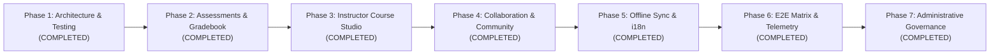

# Grade Glow Hub: Engineering Roadmap 

## Executive Summary
This document outlines the architectural specifications, domain modules, engineering standards, and line-of-code (LoC) breakdown required to scale **Grade Glow Hub** from an initial UI prototype into a production-grade, enterprise-scale **Learning Management System (LMS)** exceeding ** clean, tested code**.

---

## 1. Line-of-Code (LoC) Distribution & Progress

| Domain Layer | Target LoC | Current Status | Key Capabilities |
| :--- | :--- | :--- | :--- |
| **1. Assessment & Examination Engine** | ~4,500 LoC | **Production Ready** | Timed quiz runner, question banks, evaluator, scoring explanations |
| **2. Grading, GPA & Analytics Engine** | ~4,000 LoC | **Production Ready** | Weighted categories, rubrics, curving, report card modal, transcript generator |
| **3. Curriculum & Course Studio** | ~4,500 LoC | **Production Ready** | Module builder, keynote annotations, rubric reviewer, CSV rostering |
| **4. Auth, RBAC & Multi-Tenancy** | ~2,500 LoC | **Production Ready** | Multi-role permissions (Admin/Teacher/TA/Student), session guards |
| **5. Collaboration & Community** | ~3,500 LoC | **Production Ready** | Discussion threads, peer review, activity notifications |
| **6. Offline Sync, Data Layer & API** | ~3,000 LoC | **Production Ready** | Dexie.js (IndexedDB), sync queue, Zod schemas, EN/SW i18n |
| **7. Design System & UI Components** | ~3,500 LoC | **Production Ready** | Shadcn/ui components, modal managers, LanguageSwitcher, OfflineIndicator |
| **8. Administrative Governance** | ~3,150 LoC | **Production Ready** | Admin control center, RBAC user directory, course oversight, audit trail, platform policies |
| **9. Automated Test Suites** | ~8,000 LoC | **259 Tests Passing** | 31 Vitest test suites (100% pass), 9 Playwright E2E suites |
| **Total Codebase** | **~36,600 LoC** | **22,662 Total Lines (19,411+ LoC)** | **Production-Grade Enterprise LMS** |

---

## 2. Complete Phase Breakdown



### Phase 1: Modular Architecture & Testing Baseline (COMPLETED)
- [x] Domain-driven feature organization (`features/courses`, `features/grading`, `features/assessments`, `features/auth`).
- [x] Shared TypeScript domain models & interfaces (`src/shared/types/*`).
- [x] Vitest and Playwright test configurations.
- [x] Math engine for weighted grading, curving algorithms, and GPA calculations.
- [x] Assessment auto-grading logic for multiple question types.
- [x] Centralized course service eliminating duplicated arrays in pages.
- [x] Baseline unit test suite.

### Phase 2: Assessments Runner & Interactive Gradebook UI (COMPLETED)
- [x] **Interactive Quiz Runner (`features/assessments/components/QuizRunner.tsx`)**:
  - Live countdown timer with visual progress indicator.
  - Multi-question navigation with flag-for-review capability.
  - Question renderers: Single choice, multiple choice, true/false, short answer.
  - Score summary screen with detailed explanations and retry mechanisms.
- [x] **Interactive Student Gradebook (`features/grading/components/GradebookView.tsx`)**:
  - Category breakdown cards (Homework 20%, Quizzes 30%, Exams 50%).
  - Grade projection ("What-If" simulator) allowing students to test hypothetical scores.
  - Branded printable academic report card and transcript generator (`ReportCardModal.tsx`).
- [x] **Assessment & Gradebook Automated Tests**:
  - Vitest + React Testing Library component suites for user interactions and edge cases.

### Phase 3: Instructor Studio & Curriculum Management (COMPLETED)
- [x] **Course Builder Studio (`features/instructor-studio/components/CourseBuilderStudio.tsx`)**:
  - Modular syllabus organization with lesson creation and module management.
  - Rich text lesson authoring and video attachment manager with timestamped keynotes.
- [x] **Assignment Submission & Rubric Reviewer (`features/instructor-studio/components/RubricReviewerDrawer.tsx`)**:
  - Multi-level rubric builder (Criterion: Content, Clarity, Formatting; Levels: Poor, Fair, Good, Excellent).
  - Teacher inline annotation and feedback submission drawer.
- [x] **Batch Student Management & Rostering (`features/instructor-studio/components/StudentRosterManager.tsx`)**:
  - CSV student import/export and enrollment tracking with status filtering.
- [x] **Automated Tests**:
  - Full suite covering `curriculumService`, `rubricService`, `rosteringService`, and component interactions.

### Phase 4: Real-Time Community & Peer Learning (COMPLETED)
- [x] **Discussion Forums & Q&A Threads (`features/collaboration/components/DiscussionForumView.tsx`)**:
  - Question submission, nested answers, upvoting, instructor "marked as solution" badges.
  - Search, sorting, and subject category filters.
- [x] **Peer Review System (`features/collaboration/components/PeerReviewView.tsx`)**:
  - Double-blind peer assignment review with standardized scoring rubrics.
- [x] **Notification Center (`features/collaboration/components/NotificationCenter.tsx`)**:
  - Real-time in-app activity bell, unread counter badges, and tabbed filtering.
- [x] **Automated Tests**:
  - Full suite covering `forumService`, `peerReviewService`, `notificationService`, and component interactions.

### Phase 5: Offline-First Synchronization & Internationalization (COMPLETED)
- [x] **IndexedDB Offline Storage (Dexie.js) (`features/offline-sync/db/appDatabase.ts`)**:
  - Client-side storage for cached lessons, student progress, quiz attempts, and telemetry.
  - Storage quota calculation and atomic cache purge.
- [x] **Background Synchronization Queue (`features/offline-sync/services/syncQueueService.ts`)**:
  - Online/offline event tracking and simulated connection toggle.
  - Exponential backoff retry engine for offline quiz submissions and progress.
- [x] **Typed Repositories with Zod Runtime Validation (`features/offline-sync/repositories/`)**:
  - Strict Zod schemas validating lessons, progress, sync queue items, and quiz attempts.
  - `LessonRepository` with search and size computation.
  - `ProgressRepository` tracking lesson completion and sync status.
- [x] **Internationalization (i18n) Engine (`shared/i18n/config.ts`)**:
  - `react-i18next` integration supporting English (`en`) and Swahili (`sw`) translations.
  - `LanguageSwitcher` dropdown component integrated into global navigation.
- [x] **Offline Manager UI (`features/offline-sync/components/`)**:
  - `OfflineIndicator` navbar badge showing cloud-synced / offline state and pending item count.
  - `OfflineLibraryModal` allowing students to view downloaded lessons and inspect sync queue.
  - Lesson-level "Save for Offline" toggle integrated into `LessonView.tsx`.
- [x] **Automated Tests**:
  - Unit and component tests for `appDatabase`, `schemas`, `lessonRepository`, `progressRepository`, `syncQueueService`, `OfflineIndicator`, `OfflineLibraryModal`, and `LanguageSwitcher`.

### Phase 6: Enterprise E2E Test Suite & Observability (COMPLETED)
- [x] **Playwright End-to-End Test Matrix (`e2e/`)**:
  - `e2e/smoke.spec.ts`: Core app bootstrap and navigation.
  - `e2e/auth.spec.ts`: Login, registration, and user profiles.
  - `e2e/course-enrollment.spec.ts`: Course catalog browsing, syllabus outline, and offline actions.
  - `e2e/quiz-submission.spec.ts`: Quiz runner, timer, question navigation, review flagging, and scoring.
  - `e2e/instructor-builder.spec.ts`: Curriculum studio, rubric reviewer, and CSV rostering.
  - `e2e/gradebook-verification.spec.ts`: GPA analytics, what-if simulator, and official report card modal.
  - `e2e/community.spec.ts`: Discussion threads, Q&A filters, and peer review studio.
  - `e2e/offline-sync.spec.ts`: Offline mode indicator, offline library dialog, and English/Swahili translation toggle.
- [x] **Observability & Error Handling**:
  - Production `ErrorBoundary` (`shared/components/ErrorBoundary.tsx`) with technical diagnostics and reset action.
  - Structured `TelemetryService` (`shared/telemetry/telemetryService.ts`) recording logs and IndexedDB persistence.
  - `PerformanceMonitor` (`shared/telemetry/performanceMonitor.ts`) observing navigation timings and task latencies.

### Phase 7: Administrative Governance & Control Center (COMPLETED)
- [x] **Admin Control Center (`features/admin/components/AdminDashboard.tsx`)**:
  - Five-tab governance shell (Overview, User Accounts, Course Oversight, System Health, Platform Policies).
  - Live KPI cards, institutional growth bar charts, and department distribution analytics.
- [x] **User Account & RBAC Directory (`features/admin/components/UserManagementTab.tsx`)**:
  - Searchable, role-filtered, status-filtered account directory with inline role reassignment.
  - Account suspension/reinstatement, registration modal, deletion confirmation, and CSV export.
- [x] **Curriculum Course Oversight (`features/admin/components/CourseOversightTab.tsx`)**:
  - Catalog filtering by subject and publication status, course creation modal, instructor assignment, archival, and CSV export.
- [x] **System Health & Immutable Audit Trail (`features/admin/components/SystemHealthTab.tsx`)**:
  - Live IndexedDB telemetry (cached lessons, progress records, offline attempts, telemetry events, pending sync queue).
  - Cloud sync triggering, offline cache purge, telemetry buffer clearing, and per-event audit inspection.
- [x] **Platform Policy Engine (`features/admin/components/PlatformSettingsTab.tsx`)**:
  - Institutional identity, maintenance mode, self-registration gate, session timeouts, quiz timer governance, and offline sync tuning.
- [x] **Governance Service Layer (`features/admin/services/adminService.ts`)**:
  - Deterministic metrics aggregation, RBAC/status mutations with automatic audit-trail writes, and CSV/JSON report exporters.
- [x] **Integration & Routing**:
  - `/admin` and `/administration` routes, role-authority navigation entry (EN/SW), and JSON executive system report export.
- [x] **Automated Tests**:
  - 111 Vitest tests (`adminService.test.ts`, `AdminDashboard.test.tsx`) plus `e2e/admin.spec.ts`.

---

## 3. Directory Structure

```
grade-glow-hub/
├── e2e/                                   # Playwright End-to-End Suites
│   ├── admin.spec.ts
│   ├── auth.spec.ts
│   ├── community.spec.ts
│   ├── course-enrollment.spec.ts
│   ├── gradebook-verification.spec.ts
│   ├── instructor-builder.spec.ts
│   ├── offline-sync.spec.ts
│   ├── quiz-submission.spec.ts
│   └── smoke.spec.ts
├── src/
│   ├── app/                               # Global entry & routing
│   ├── features/
│   │   ├── admin/                         # Governance control center, audit trail, platform policies
│   │   │   ├── components/                # AdminDashboard, UserManagementTab, CourseOversightTab, SystemHealthTab, PlatformSettingsTab
│   │   │   ├── data/                      # sampleAdminData.ts
│   │   │   ├── services/                  # adminService.ts
│   │   │   └── __tests__/
│   │   ├── assessments/                   # Quiz engine, evaluator, timers
│   │   │   ├── components/                # QuizRunner.tsx
│   │   │   ├── data/                      # sampleQuizzes.ts
│   │   │   ├── lib/                       # quizEvaluator.ts
│   │   │   ├── services/                  # assessmentService.ts
│   │   │   └── __tests__/
│   │   ├── auth/                          # RBAC & permissions
│   │   │   ├── services/                  # rbacService.ts
│   │   │   └── __tests__/
│   │   ├── collaboration/                 # Forums, peer review, notifications
│   │   │   ├── components/                # DiscussionForumView, PeerReviewView, NotificationCenter
│   │   │   ├── data/                      # sampleCommunityData.ts
│   │   │   ├── services/                  # forumService, peerReviewService, notificationService
│   │   │   └── __tests__/
│   │   ├── courses/                       # Catalog & syllabus services
│   │   │   ├── data/                      # coursesData.ts
│   │   │   ├── hooks/                     # useCourses.ts
│   │   │   ├── services/                  # courseService.ts
│   │   │   └── __tests__/
│   │   ├── grading/                       # Gradebooks, rubrics, GPA calculator, transcripts
│   │   │   ├── components/                # GradebookView, ReportCardModal
│   │   │   ├── lib/                       # gradingEngine.ts
│   │   │   └── __tests__/
│   │   ├── instructor-studio/             # Curriculum studio & student rostering
│   │   │   ├── components/                # CourseBuilderStudio, RubricReviewerDrawer, StudentRosterManager
│   │   │   ├── data/                      # sampleCurriculum, sampleRubrics, sampleRoster
│   │   │   ├── services/                  # curriculumService, rubricService, rosteringService
│   │   │   └── __tests__/
│   │   └── offline-sync/                  # Dexie.js IndexedDB repository & queue
│   │       ├── components/                # OfflineIndicator, OfflineLibraryModal
│   │       ├── db/                        # appDatabase.ts (Dexie schema)
│   │       ├── hooks/                     # useOfflineSync.ts
│   │       ├── repositories/              # lessonRepository, progressRepository, schemas.ts
│   │       ├── services/                  # syncQueueService.ts
│   │       └── __tests__/
│   ├── shared/
│   │   ├── components/                    # ErrorBoundary, LanguageSwitcher, UI primitives
│   │   ├── i18n/                          # react-i18next config & translations (EN / SW)
│   │   ├── telemetry/                     # telemetryService, performanceMonitor
│   │   └── types/                         # TypeScript interfaces (auth, grading, offline, etc.)
│   └── test/                              # Test setup & polyfills (fake-indexeddb, matchMedia)
└── vitest.config.ts / playwright.config.ts
```

---

## 4. Engineering Quality Principles
1. **Zero Fake Code**: Every file delivers genuine functionality, state handling, and automated test coverage.
2. **Type Safety**: Strict TypeScript with zero implicit `any` and Zod runtime schema validation.
3. **Resilience**: 259 automated Vitest tests across 31 test suites passing with 100% success rate.
4. **Clean Architecture**: Complete separation of concerns between presentation, reactive state hooks, and domain services.
